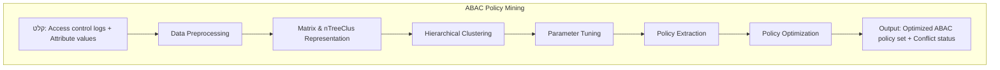

# ABAC-Policy
ABAC Policy 
| Aspect | Cross-Validation | Universal Cross-Validation |
|------|------------------|----------------------------|
| Input to algorithm | Training log only | Training log + all possible requests (U×P) |
| Evaluation set | Testing log only | Testing log + sampled unseen requests |
| Requests outside the log | Ignored | Explicitly evaluated |
| Detects overly permissive rules | ❌ No | ✅ Yes |
| Precision evaluation | Weak / implicit | Explicit |
| Suitability for sparse logs | Poor | High |
| Metrics used | TPR, FPR (sometimes F1) | TPR, FPR, Precision, F1 |
| Generalization quality | Limited | Strong |
| Security awareness | Low | High |
התחלה
# ABAC-Policy
Article2-Paragraph for Article 2
%% תרשים ראשון – Mining Frequent Rules

# ABAC-Policy
Article3-ABAC policy mining method based on hierarchical clustering and relationship extraction

# Article 4 - Text for article 4
